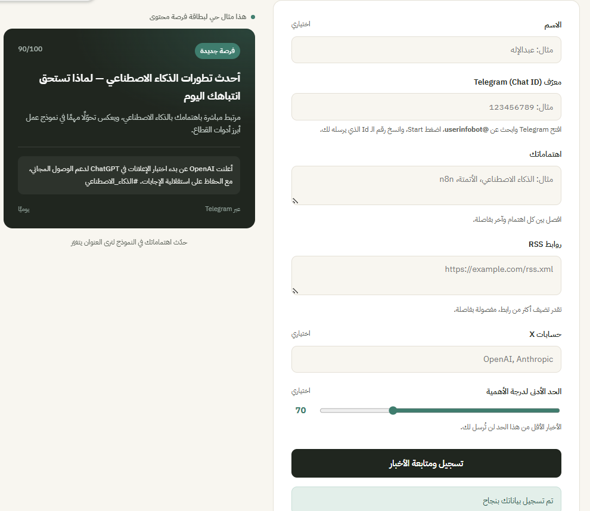
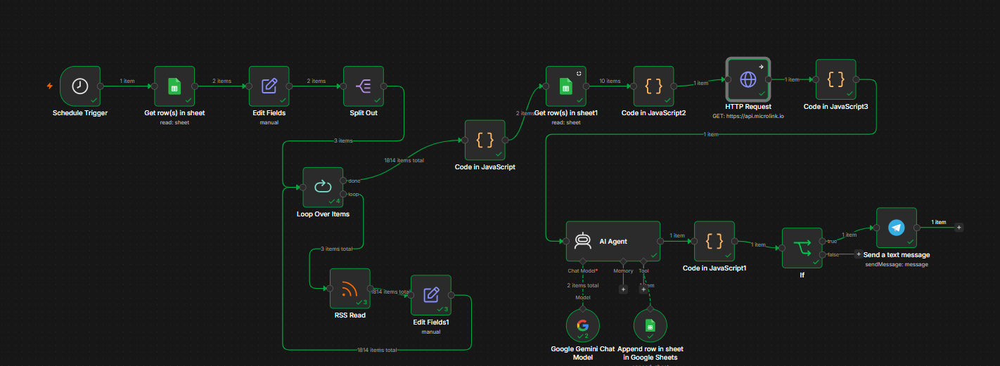
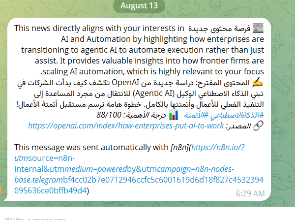

<div dir="rtl" align="right">

# 🧭 رادار الفرص — نظام أتمتة اكتشاف فرص المحتوى

نظام أتمتة ذكي مبني على **n8n** يراقب مصادر RSS بناءً على اهتمامات كل مستخدم، يحلل الأخبار بالذكاء الاصطناعي عبر **AI Agent**، ويرسل بطاقة فرصة محتوى جاهزة على **Telegram** يوميًا — بدون أي تدخل يدوي.

---

## 💡 الفكرة

صانع المحتوى يواجه صعوبة في متابعة كل الأخبار المرتبطة بمجاله وسط الكم الهائل من المصادر. هذا المشروع يحل المشكلة: المستخدم يسجل اهتماماته ومصادره مرة واحدة، والنظام يتكفل بالباقي — مراقبة يومية، تحليل ذكي، وتوصيل النتيجة جاهزة للنشر.

---

## ⚙️ كيف يشتغل

```
تسجيل المستخدم (واجهة ويب)
        ↓
     Webhook → تحقق من البيانات → حفظ في Google Sheets
        ↓
  Schedule Trigger (يوميًا)
        ↓
  قراءة المستخدمين → جلب أخبار RSS → أحدث ٥ أخبار لكل مستخدم
        ↓
  فلترة الأخبار المكررة (مقارنة مع سجل سابق)
        ↓
  API خارجي (Microlink) → إثراء بيانات الخبر
        ↓
  AI Agent (Google Gemini) → تحليل + تقييم + قرار
        ↓
  Telegram → إرسال بطاقة الفرصة للمستخدم
```

---

## 🧩 المكونات التقنية

| المكوّن | التقنية |
|---|---|
| الأتمتة والـ Workflows | n8n |
| الذكاء الاصطناعي | Google Gemini عبر AI Agent |
| أداة الـ Agent | Google Sheets Tool (تسجيل الأخبار المرسلة) |
| API خارجي | Microlink API |
| قاعدة البيانات | Google Sheets |
| الإشعارات | Telegram Bot |
| الواجهة الأمامية | HTML / CSS / JavaScript |

---

## 📁 محتويات الريبو

- [`register (1).html`](register%20%281%29.html) — صفحة تسجيل المستخدمين (الواجهة الأمامية)
- [`Main workflow.json`](Main%20workflow.json) — تصدير Workflow الأتمتة اليومية
- [`User Registration.json`](User%20Registration.json) — تصدير Workflow تسجيل المستخدمين

---

## 🖼️ لقطات من المشروع

**الواجهة الأمامية**


**الـ Workflow**


**بطاقة فرصة محتوى على Telegram**


---

## 🎥 فيديو توضيحي
https://drive.google.com/file/d/1wkek6RCP8O3W54fvvNBD5uoI3YL1N-LP/view?usp=drive_link

---

## 🏗️ التحديات التقنية التي حُلّت

- **فقدان ربط البيانات بعد RSS Read:** استخدمنا `Loop Over Items` مع إعادة ربط كل خبر ببيانات صاحبه فور رجوعه من العقدة.
- **منع تكرار الإرسال:** بناء طبقة فلترة تقارن كل خبر جديد مع سجل الأخبار المرسلة سابقًا قبل ما يوصل للذكاء الاصطناعي.
- **محدودية استدعاءات الذكاء الاصطناعي المجانية:** تحويل التوقيت من كل ١٠ دقائق إلى تشغيل يومي واحد، لتقليل الاستهلاك.

---

## 👤 الفريق

عبدالإله عواد المشدق

</div>
